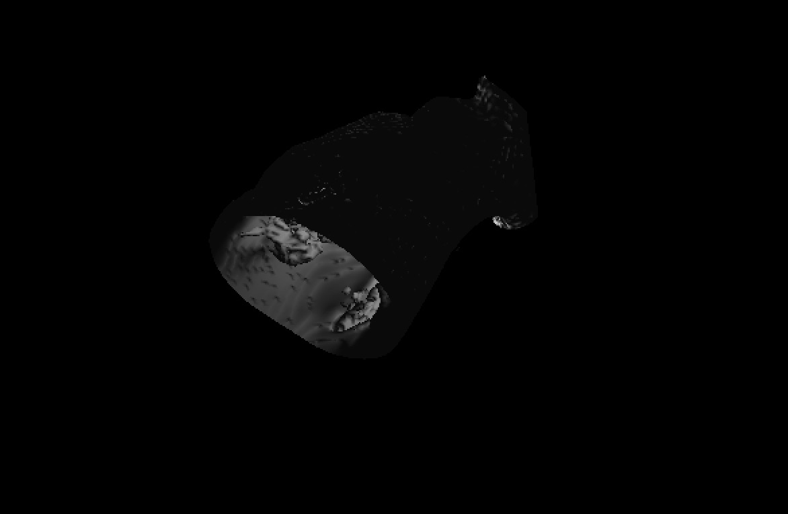
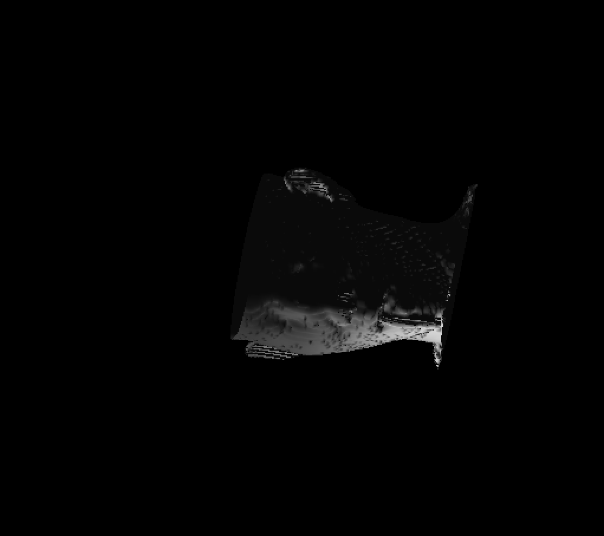

# marching cube algorithm implementation and opengl display
The second part of this project is the realization and display of the marching cube algorithm. The project provides the realization of the marching cube algorithm, and the display and interaction effects of opengl+glut.

Dependent libraries used in this project

> - OpenGL
> - GLUT

```
This project reads in 3D image information from a vtk standard structured point file, implements it using the marching cube algorithm, and displays it interactively.
```

## Implementation content summary

> - Read in the vtk structured point file that stores 3D image information and set the corresponding data structure
> - marching cube algorithm (version 256, because version 16 has been proved to be incomplete), output mesh (point, triangle index, and normal)
> - glut+opengl2/opengl4 for rendering and display output becomes obj
> - Some classic algorithms that have been implemented in the renderer I implemented, such as the direction of the triangle normal vector, etc.

## Inadequacies of the implementation

> - Temporarily unable to get the mrh image data set that the teacher said, did not reproduce the dicom database
>
> - Due to the marching cube algorithm itself, the holy may not detect the hole, but I believe this is another category of closedness detection algorithm
>
>

## Notice

Note: This project provides two versions of render implementations, opengl2 and opengl4, which correspond to two folders of gl and opengl4 respectively. However, the author’s mac computer uses an old version of the os system, so only the implementation of opengl2 is tested correctly, and the implementation of opengl4 is correct. Test it on a linux computer after school starts.

## final effect





与此原文有关的更多信息要查看其他翻译信息，您必须输入相应原文
发送反馈
侧边栏
