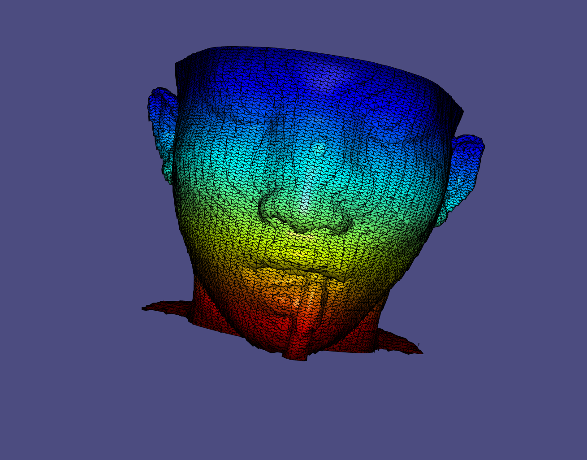

#marching cube算法实现及opengl显示
本项目中的第二部分，即为marching cube算法实现和显示，项目提供了marching cube的算法实现，和opengl+glut的显示和交互效果。

本项目使用的依赖库

> - OpenGL 
> - GLUT 

```
本项目从一个vtk标准的structured point文件读入三维图像信息，使用marching cube算法进行实现，并予以交互显示。
```

## 实现内容综述

> - 读入存储三维图像信息的vtk的structured point文件 设置对应的数据结构
> - marching cube算法（256版本，因为16版本已经证明不完善），输出mesh（point，triangle index，and normal）
> - glut+opengl2/opengl4 进行渲染显示 输出成为obj
> - 一些经典的已经在我实现的渲染器中实现过的算法 比如三角形法向量方向一致等等

## 实现的不足之处

> - 暂时拿不到老师说的mrh图像数据集 没有对dicom数据库进行复现
>
> - 由于marching cube算法本身就可能出现holy 没有对hole进行检测，但我相信这是另一个封闭性检测算法的范畴了
>
>   

## 注意

note：本项目提供了opengl2和opengl4两个版本的render实现，分别对应gl和opengl4两个文件夹，但是笔者的mac电脑使用的是老版本的os系统，所以只测试了opengl2实现无误，opengl4实现待开学后在linux电脑上测试。

## 最终效果





